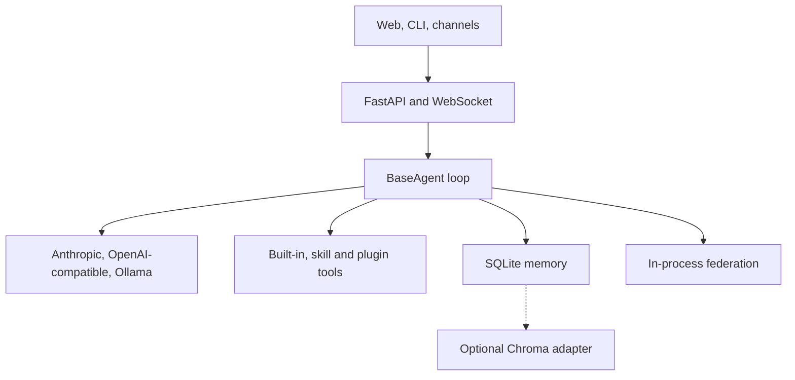

<div align="center">

# MIZAN

### An evidence-first agentic AI research prototype

**Python · FastAPI · LLM tool calling · persistent memory · extensible agents**

[](https://github.com/CodeWithJuber/mizan/actions/workflows/ci.yml)
[](https://www.python.org/downloads/)
[](pyproject.toml)
[](LICENSE)

[Reviewer quick view](#reviewer-quick-view) · [Run locally](#run-locally) · [Architecture](#architecture) · [Build a plugin](#build-a-plugin) · [API](#api-surface) · [Docs](docs/) · [Contributing](CONTRIBUTING.md)

</div>

---

> **Project status:** MIZAN is an open-source **beta research and engineering prototype**. It contains executable implementations of an agent loop, provider-normalized tool calling, local memory, APIs, plugins, tests and container packaging. This repository does **not** claim verified enterprise production use.

## Reviewer quick view

MIZAN explores how a self-hostable personal assistant can combine LLM reasoning, tool execution, memory and custom cognitive-control modules in one Python application. This section separates what can be verified in the repository from experimental or absent capabilities.

### What the code demonstrates

| Area | Verifiable implementation | Evidence | Boundary |
|---|---|---|---|
| Agent loop | Iterative model → tool → result → model execution with bounded turns | [`BaseAgent._agentic_loop`](backend/agents/base.py), [`BaseAgent._execute_tool_safe`](backend/agents/base.py) | Implemented in source; no claim of external production operation |
| Tool/function calling | JSON tool schemas, Anthropic `tool_use`, OpenAI-compatible function-call conversion and parsing | [`backend/agents/base.py`](backend/agents/base.py), [`backend/providers.py`](backend/providers.py) | Provider integration code exists; repository tests are not evidence of live calls to every provider |
| Tools | HTTP, filesystem, Bash, Python execution, memory recall, delegation, skill and plugin tools | [`BaseAgent._register_base_tools`](backend/agents/base.py), [`backend/skills`](backend/skills) | Execution is gated by repository security checks; operators remain responsible for isolation and permissions |
| Memory | SQLite-backed episodic/semantic/procedural storage and recall, plus graph and pathway experiments | [`backend/memory/dhikr.py`](backend/memory/dhikr.py), [`backend/memory/knowledge_graph.py`](backend/memory/knowledge_graph.py), [`backend/memory/masalik.py`](backend/memory/masalik.py) | Default operation is local and prototype-scale |
| Knowledge ingestion | URL, PDF and YouTube extraction with chunking and storage endpoints | [`backend/knowledge/ingest.py`](backend/knowledge/ingest.py), [`backend/api/main.py`](backend/api/main.py) | Ingestion and retrieval components exist; this is not presented as a production-grade RAG platform |
| Agent coordination | In-process registration, capability matching, message routing and task delegation | [`backend/agents/federation.py`](backend/agents/federation.py), [`tests/test_agent_comprehensive.py`](tests/test_agent_comprehensive.py) | Implemented locally; not a distributed multi-agent runtime |
| Guardrails | Permission levels, tool validation, rate limits, SSRF/path/command checks and audit events | [`backend/security/izn.py`](backend/security/izn.py), [`backend/security/wali.py`](backend/security/wali.py), [`tests/test_security_comprehensive.py`](tests/test_security_comprehensive.py) | Deterministic application controls, not a complete enterprise security boundary |
| Python engineering | Async FastAPI services, Pydantic configuration, provider adapters, task queue, SQLite and PyTorch experiments | [`backend`](backend), [`ruh_model`](ruh_model), [`pyproject.toml`](pyproject.toml) | Demonstrates implementation breadth; it does not establish deployment scale by itself |
| Delivery scaffolding | Python-version CI matrix, linting, tests, package build and Docker image builds | [CI workflow](.github/workflows/ci.yml), [`docker-compose.prod.yml`](docker-compose.prod.yml), [`docker/Dockerfile.backend.prod`](docker/Dockerfile.backend.prod) | Deployable scaffolding, not evidence of a live production service |

### Test and build proof

- CI is defined for Python 3.11, 3.12 and 3.13 in [`.github/workflows/ci.yml`](.github/workflows/ci.yml).
- The [24 August 2026 CI run](https://github.com/CodeWithJuber/mizan/actions/runs/32774615854) completed the test, lint, package-build and Docker-build jobs; its test log reported **557 passed and 8 skipped** for that repository snapshot.
- Unit and API coverage includes agent routing, memory, security, cognitive modules and application endpoints under [`tests/`](tests).
- The package metadata explicitly classifies the project as **Beta** in [`pyproject.toml`](pyproject.toml).

The test count above is a dated snapshot, not a promise that every future commit has the same count. The workflow badge is the current signal.

### Maturity boundary

| Status | Capability | Precise boundary |
|---|---|---|
| Implemented | Custom agent loop and tool calling | The loop, schemas, provider translations, validation and tool-result continuation are executable source |
| Implemented | Persistent local memory | SQLite storage and retrieval paths are present and tested |
| Implemented | In-process agent federation | Agents can be registered, selected by capability and delegated work inside the running process |
| Implemented | FastAPI, WebSocket, CLI and plugin surfaces | Application interfaces and extension points are present in source |
| Partial / experimental | Chroma vector search | A [`VectorStore`](backend/memory/vector_store.py) client and Docker profile exist, but Chroma is not wired into the default memory construction path; the unified pyramid integration still needs async/configuration hardening and integration tests |
| Partial / experimental | Human approval | [`Izn`](backend/security/izn.py) can classify actions as approval-required and retain pending requests; a complete approve/reject-and-resume API workflow is not yet implemented |
| Partial / experimental | Multi-agent council and parallel deliberation | Basic federation/delegation is implemented, but [`agents/shura_council.py`](backend/agents/shura_council.py) and [`core/parallel_agents.py`](backend/core/parallel_agents.py) contain placeholder or heuristic generation paths; [`core/architecture.py`](backend/core/architecture.py) marks consensus construction as simplified |
| Partial / experimental | Custom Ruh model | Transformer, tokenizer, loss and training code exist under [`ruh_model/`](ruh_model); no released checkpoint or benchmark result is claimed |
| Not included | Named orchestration frameworks | No LangGraph, LangChain, Semantic Kernel, AutoGen, CrewAI or Copilot Studio implementation is claimed |
| Not included | Azure AI | No Azure OpenAI or Azure AI Foundry integration or deployment is claimed |
| Not included | Enterprise RPA/application suite | No Salesforce, ServiceNow, SAP, Microsoft 365/Graph or RPA-platform implementation is claimed |
| Not evidenced | Production use | The repository does not provide customer, traffic, SLO, production telemetry or verified live-deployment evidence |

## What MIZAN is

MIZAN is a personal AI assistant and an experimental framework for studying agent control, memory and extensibility. It can be run with a configured cloud LLM provider or with Ollama on a local machine.

Core goals:

- make tool execution explicit, inspectable and permission-gated;
- keep application state and memories under the operator's control;
- normalize several model-provider interfaces behind one agent loop;
- support new tools, providers, channels and behaviors through extension points;
- explore QALB-7, a cognitive architecture inspired by concepts from Islamic psychology.

If Anthropic, OpenAI or OpenRouter is selected, prompts and relevant context are sent to that configured provider under its terms. Local application state does not make a cloud-backed model call local.

## Architecture



The dotted edge marks the incomplete default Chroma wiring described below.

### Agent execution path

The central loop in [`backend/agents/base.py`](backend/agents/base.py) performs the following bounded sequence:

1. Build provider-compatible tool schemas from built-in, skill and plugin tools.
2. Ask the selected provider for the next response.
3. Inspect structured tool requests.
4. Validate tool input and pass the request through Fitrah and Izn permission gates.
5. Execute the selected handler and append a tool-result message.
6. Continue until the provider returns a final response or the configured turn limit is reached.

[`backend/providers.py`](backend/providers.py) normalizes provider responses. Anthropic uses native `tool_use` blocks; the OpenAI-compatible adapter translates the same internal schemas to function tools and parses returned calls.

### QALB-7 research modules

QALB-7 is the project's organizing vocabulary for experimental cognitive controls. Module names describe code-level abstractions, not claims of human cognition or independently validated reasoning performance.

| Module | Purpose in this repository | Source |
|---|---|---|
| Fitrah | Deterministic ethical/action gate | [`backend/core/fitrah.py`](backend/core/fitrah.py) |
| Nafs Triad | Competing heuristic perspectives on an approach | [`backend/core/nafs_triad.py`](backend/core/nafs_triad.py) |
| Qalb Processor | State-dependent model-parameter modulation | [`backend/core/qalb_processor.py`](backend/core/qalb_processor.py) |
| Fu'ad | Evidence and conviction tracking | [`backend/core/fuad.py`](backend/core/fuad.py) |
| Lubb | Trace compression, coherence and bias checks | [`backend/core/lubb.py`](backend/core/lubb.py) |
| Developmental stages | Turn, tool and autonomy capability gates | [`backend/core/developmental_stages.py`](backend/core/developmental_stages.py) |
| Causal engine | Observational, interventional and counterfactual data structures/heuristics | [`backend/reasoning/causal_engine.py`](backend/reasoning/causal_engine.py) |

Additional experiments include multimodal perception, recovery state machines, novelty-sensitive memory, imagination/creativity modules, dream-style consolidation and quaternary integrity checks. See [`backend/core`](backend/core), [`backend/perception`](backend/perception), [`backend/reasoning`](backend/reasoning) and [`backend/memory`](backend/memory).

### Memory and retrieval

| Component | Current role | Status |
|---|---|---|
| Dhikr | SQLite-backed episodic, semantic and procedural memory | Implemented and exercised by tests |
| Masalik | Pathway graph with spreading activation | Implemented experimental module |
| Knowledge graph | SQLite entity/relationship storage and search | Implemented experimental module |
| Living memory | In-memory trace lifecycle and novelty heuristics, with optional vector hooks | Experimental |
| VectorStore | Async Chroma HTTP adapter for store/search/delete/count | Adapter implemented; not active in the default memory path |
| MemoryPyramid | Intended merger across memory layers | Experimental integration; requires further async and end-to-end hardening |

Knowledge ingestion accepts web pages, PDFs and YouTube transcripts, applies overlapping chunking, and stores content through the memory APIs. A production RAG implementation would additionally require verified embedding generation, default vector wiring, retrieval/reranking evaluation, source-attribution behavior, versioned indexing and load/reliability testing.

### Agent coordination

[`backend/agents/federation.py`](backend/agents/federation.py) provides process-local agent discovery, capability matching, messaging and task delegation. [`backend/reasoning/planner.py`](backend/reasoning/planner.py) can ask an LLM for a JSON task decomposition and execute dependency-ready work.

This is evidence of a custom coordination prototype. It is not presented as:

- a distributed agent mesh;
- orchestration built with LangGraph, LangChain, Semantic Kernel, AutoGen or CrewAI;
- a validated council-consensus system; or
- parallel LLM-agent execution at enterprise scale.

### Security and approval controls

The repository includes:

- permission levels and per-tool checks in [`backend/security/izn.py`](backend/security/izn.py);
- command, path, URL and input validation in [`backend/security/wali.py`](backend/security/wali.py) and [`backend/security/validation.py`](backend/security/validation.py);
- SSRF-oriented URL controls, rate limits and in-memory audit events;
- JWT/API-key application authentication in [`backend/security/auth.py`](backend/security/auth.py);
- recovery-state and health-check experiments in [`backend/core/tawbah.py`](backend/core/tawbah.py), [`backend/core/self_healing.py`](backend/core/self_healing.py) and [`backend/doctor.py`](backend/doctor.py).

These are defense-in-depth application controls, not a substitute for container/VM isolation, least-privilege credentials, network policy, secrets management or an enterprise identity provider. Authentication, revocation and several coordination controls retain process-local state. Human approval is modeled, but blocked work cannot yet be approved/rejected and resumed through a complete supported API flow.

## Run locally

### Requirements

- Python 3.11 or newer
- At least one of:
  - an Anthropic API key;
  - an OpenAI API key;
  - an OpenRouter API key; or
  - a reachable Ollama server for local inference
- Node.js 20 or newer for frontend development
- Docker and Docker Compose for the containerized path

### Docker Compose

```bash
git clone https://github.com/CodeWithJuber/mizan.git
cd mizan
cp .env.example .env
# Edit .env: set a strong SECRET_KEY and configure a provider.
docker compose up -d --build
```

With the checked-in development Compose file:

- frontend: `http://localhost:3100`
- API: `http://localhost:8000`
- interactive API docs: `http://localhost:8000/docs`

Optional profiles:

```bash
# Include local Ollama service
docker compose --profile ollama up -d --build

# Start the optional Chroma service as well
docker compose --profile ollama --profile vector up -d --build
```

The profiles start the optional service containers. In the current `docker-compose.yml`, starting the Ollama profile does not itself select Ollama as the backend provider, and starting Chroma does not complete the default application-to-Chroma memory wiring. Review the provider and memory configuration before assuming either service is active in application requests.

Common commands:

| Task | Command |
|---|---|
| Show service state | `docker compose ps` |
| Follow logs | `docker compose logs -f` |
| Restart | `docker compose restart` |
| Stop | `docker compose down` |
| Rebuild | `docker compose up -d --build` |

`docker compose down -v` removes named volumes and their stored data. Use it only when a full local reset is intended.

### From source

```bash
git clone https://github.com/CodeWithJuber/mizan.git
cd mizan
python -m venv .venv
source .venv/bin/activate
python -m pip install --upgrade pip
pip install -e ".[dev]"
cp .env.example .env
# Edit .env, then:
make serve
```

On Windows PowerShell, activate the environment with:

```powershell
.\.venv\Scripts\Activate.ps1
```

For backend and frontend development together:

```bash
make setup
make dev
```

The package exposes the `mizan` command through [`pyproject.toml`](pyproject.toml):

```bash
mizan setup
mizan chat
mizan serve
mizan status
mizan doctor --check
```

### Provider configuration

Set one provider in `.env`. [`backend/providers.py`](backend/providers.py) is the authoritative implementation.

| Provider path | Primary configuration | Notes |
|---|---|---|
| Anthropic | `ANTHROPIC_API_KEY` | Native Anthropic message/tool format |
| OpenAI | `OPENAI_API_KEY` | OpenAI-compatible adapter |
| OpenRouter | `OPENROUTER_API_KEY` | OpenAI-compatible endpoint |
| Ollama | `OLLAMA_URL` | Local or operator-hosted server |

Azure OpenAI and Azure AI Foundry are not current provider options.

Known CLI boundary: `mizan setup` currently prompts for Anthropic and OpenRouter credentials, while OpenAI and Ollama settings must be edited in `.env`. `mizan chat` also checks a `has_any_provider` property that currently counts the three API-key providers but not Ollama. The Ollama adapter exists, but an Ollama-only CLI session should not be assumed to work until that preflight is corrected.

## Build a plugin

Plugins can register tools, subscribe to events and add hooks without changing the central agent loop.

```text
plugins/
└── my_plugin/
    ├── plugin.json
    └── main.py
```

`plugins/my_plugin/plugin.json`:

```json
{
  "name": "my_plugin",
  "version": "1.0.0",
  "description": "Example plugin",
  "author": "Your Name",
  "permissions": [],
  "tags": ["example"],
  "enabled": true
}
```

`plugins/my_plugin/main.py`:

```python
from core.plugins import PluginBase


class Plugin(PluginBase):
    async def on_load(self):
        self.add_tool(
            "weather",
            self.get_weather,
            {
                "name": "weather",
                "description": "Get example weather data for a city",
                "input_schema": {
                    "type": "object",
                    "properties": {"city": {"type": "string"}},
                    "required": ["city"],
                },
            },
        )
        self.on_event("task.completed", self.on_task_done)

    async def on_unload(self):
        pass

    async def get_weather(self, city: str):
        # Replace this deterministic example with a real, permissioned data source.
        return {"city": city, "temperature_c": 22, "condition": "example"}

    async def on_task_done(self, data):
        print(f"Task completed: {data}")
```

The main extension surfaces are:

| Surface | Starting point |
|---|---|
| Plugins | [`backend/core/plugins.py`](backend/core/plugins.py) |
| Skills/tools | [`backend/skills`](backend/skills) |
| Events | [`backend/core/events.py`](backend/core/events.py) |
| Hooks | [`backend/core/hooks.py`](backend/core/hooks.py) |
| Middleware | [`backend/core/middleware.py`](backend/core/middleware.py) |
| LLM providers | [`backend/providers.py`](backend/providers.py) |
| Channel adapters | [`backend/gateway/channels`](backend/gateway/channels) |
| Specialized agents | [`backend/agents/specialized.py`](backend/agents/specialized.py) |

## API surface

Run the backend and open `http://localhost:8000/docs` for the generated OpenAPI interface. The route implementation in [`backend/api/main.py`](backend/api/main.py) is authoritative.

Representative endpoints:

```text
# Authentication
POST /api/auth/login
POST /api/auth/register
POST /api/auth/api-key

# Agents, chat and tasks
GET  /api/agents
POST /api/agents
POST /api/chat
POST /api/tasks

# Memory and knowledge
POST /api/memory/query
POST /api/memory/store
POST /api/memory/consolidate
POST /api/knowledge/ingest
POST /api/knowledge/upload

# Federation
GET  /api/federation/status
POST /api/federation/discover
POST /api/federation/route

# Providers and plugins
GET  /api/providers
POST /api/providers/switch
GET  /api/plugins
POST /api/plugins/{name}/load
POST /api/plugins/{name}/unload

# Automation and diagnostics
POST /api/automation/jobs
POST /api/automation/webhooks
GET  /api/health
GET  /api/doctor
POST /api/doctor/fix

# Realtime
WS   /ws/{client_id}
```

Channel adapters are present for Telegram, Discord, Slack and WhatsApp under [`backend/gateway/channels`](backend/gateway/channels). Linode REST and SSH skills are also present. Their existence demonstrates adapter implementation; it is not proof that each connector has been exercised against a live enterprise account.

## Development

```bash
make install-dev    # Editable install plus test/lint tools
make test           # Pytest suite
make test-cov       # Coverage report
make lint           # Ruff checks
make format         # Ruff formatting and safe fixes
make typecheck      # Mypy
make check          # Lint + typecheck + tests
make build          # Build the Python package
```

### Project map

```text
mizan/
├── backend/
│   ├── agents/              # Agent loop, specialized agents, federation and council experiments
│   ├── api/main.py          # FastAPI routes and WebSocket entrypoint
│   ├── automation/          # Cron jobs and webhook triggers
│   ├── core/                # QALB-7 controls, plugins, events, hooks and recovery experiments
│   ├── gateway/channels/    # Telegram, Discord, Slack and WhatsApp adapters
│   ├── knowledge/           # URL/PDF/YouTube ingestion and chunking
│   ├── memory/              # SQLite memory, graphs, pathways and optional vector adapter
│   ├── reasoning/           # Planner, causal and iterative reasoning modules
│   ├── security/            # Auth, permissions and validation
│   ├── skills/              # Built-in and extensible tools
│   ├── providers.py         # LLM-provider normalization and tool calls
│   └── cli.py               # Command-line interface
├── frontend/                # React/TypeScript user interface
├── ruh_model/               # Experimental PyTorch language-model components
├── plugins/                 # External plugin location
├── tests/                   # Unit and API tests
├── docs/                    # Additional documentation
├── docker/                  # Development and production-oriented Dockerfiles
├── docker-compose.yml       # Local full-stack composition
├── docker-compose.prod.yml  # Production-oriented scaffolding
└── pyproject.toml           # Package metadata and dependencies
```

## Deployment status

The repository includes container, Nginx, health-check, install, update and deployment scripts. These make the prototype easier to run and evaluate; filenames containing `prod` describe intended configuration, not verified production operation.

Before treating MIZAN as production-ready, the project would need, at minimum:

- durable shared identity, API-key, revocation, rate-limit and coordination state;
- a production queue/broker with explicit retry, backoff and dead-letter behavior;
- completed Chroma/embedding integration and retrieval evaluation;
- a closed-loop human approval and resume workflow;
- secrets management and, where relevant, managed identity;
- distributed tracing, metrics, alerting, SLOs and cost/latency monitoring;
- adversarial, tool-safety, groundedness and regression evaluation;
- concurrency, load, failure-recovery and backup/restore testing;
- a documented release and rollback process; and
- deployment evidence for the intended infrastructure.

## Roadmap

Near-term engineering gaps exposed by the current implementation:

1. Complete async Chroma wiring in the default memory path and add live integration tests.
2. Add an embedding/index lifecycle, hybrid retrieval, reranking, citations and retrieval-quality evaluation.
3. Implement approve/reject/resume APIs and durable human-in-the-loop state.
4. Replace Shura and parallel-agent placeholder paths with tested provider-backed execution or narrow their public contract.
5. Add retries, backoff, idempotency and dead-letter handling to background execution.
6. Add LLM/RAG quality, safety, latency and cost regression suites.
7. Add production observability and externalize process-local state before multi-worker deployment.
8. Add cloud/framework integrations only when backed by executable code, tests and deployment evidence.

## FAQ

### Is MIZAN production-ready?

No production-readiness claim is made. It is a containerized beta prototype with CI and application security controls. See [Deployment status](#deployment-status) for the work still required.

### Does MIZAN implement RAG?

It implements ingestion, chunking, persistent retrieval components and a Chroma adapter. The default vector path is not yet wired and evaluated end to end, so the project is described as a retrieval/memory prototype rather than production RAG.

### Is MIZAN a multi-agent system?

It has implemented in-process registration, capability routing and delegation. Council synthesis and parallel LLM deliberation remain experimental or simplified, and no distributed multi-agent operation is claimed.

### Does it use LangGraph, LangChain, Semantic Kernel, AutoGen, CrewAI or Copilot Studio?

No. The current orchestration loop and federation layer are custom Python implementations.

### Does it support Azure OpenAI or Azure AI Foundry?

Not currently. Supported provider paths are listed in [Provider configuration](#provider-configuration).

### Can it run without sending prompts to a cloud model provider?

The Ollama adapter supports an operator-hosted local model path. Some tools and ingestion sources may still use network services, so offline behavior depends on which capabilities are enabled.

### Where is project data stored?

The default application memory is SQLite at the configured `DB_PATH`; Docker mounts application data to a named volume. Operators should review provider, connector and tool behavior before using sensitive data.

## Contributing

See [`CONTRIBUTING.md`](CONTRIBUTING.md). Contributions that close a documented maturity gap should include tests and update the relevant boundary statement in this README.

## License

[Apache License 2.0](LICENSE).

---

<div align="center">

MIZAN is built as an inspectable research prototype: the code is the claim, and the boundaries are part of the documentation.

</div>
